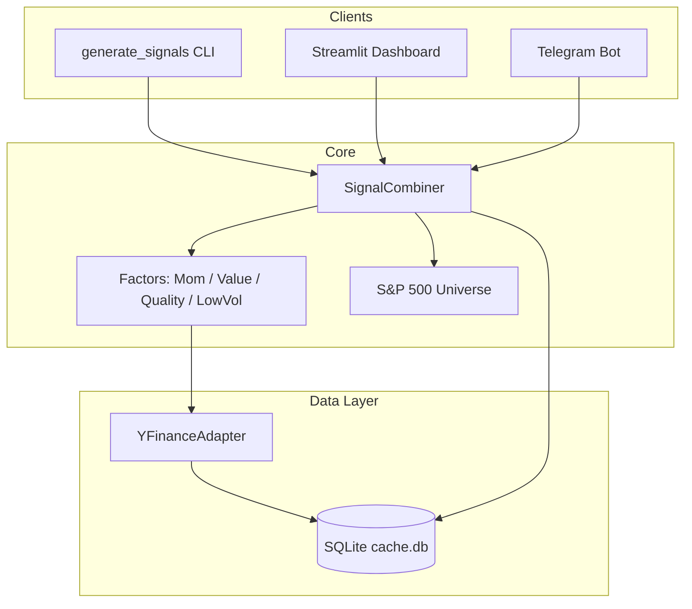

# Quant Trading Framework — Phase 1

Systematic factor-based quant trading framework: data layer, cross-sectional factor signals, Streamlit dashboard, and Telegram bot for the S&P 500 universe.

## Project overview

Phase 1 delivers ranked multi-factor signals (momentum, value, quality, low volatility) for S&P 500 constituents on any as-of date. Results persist to SQLite for the dashboard and bot.

**In scope:** data adapter + cache, four factors, combiner, CLI, Streamlit UI, Telegram bot.

**Out of scope (Phases 2–5):** backtesting, portfolio construction, risk management, execution, live trading.

## Installation

```bash
cd quant_framework
python3.11+ -m venv .venv
source .venv/bin/activate
pip install -e ".[dev]"
```

## Configuration

Copy `.env.example` to `.env` and set:

| Variable | Description | Default |
|----------|-------------|---------|
| `CACHE_PATH` | SQLite cache file | `data/cache.db` |
| `TELEGRAM_BOT_TOKEN` | Bot token (required for bot) | — |
| `TELEGRAM_AUTHORIZED_USERS` | Comma-separated Telegram user IDs | — |
| `DASHBOARD_PORT` | Streamlit port | `8501` |
| `LOG_LEVEL` | Logging level | `INFO` |
| `FUNDAMENTALS_CACHE_DAYS` | Fundamentals TTL | `30` |

## Running CLI

```bash
python -m quant_framework.scripts.generate_signals \
  --as-of-date 2026-04-30 \
  --output /tmp/signals.csv
```

Output CSV includes raw/z-score columns per factor, `combined_score`, and `rank`. A `run_id` is stored in `signal_runs` / `signal_results`.

## Running dashboard

**The dashboard does not start automatically** — you must run it in a terminal and keep that terminal open.

```bash
cd quant_framework
./scripts/start_dashboard.sh
```

Or:

```bash
cd quant_framework
source .venv/bin/activate
python scripts/run_dashboard.py
```

Then open **http://localhost:8501** in your browser (not https). Use the sidebar to pick date, weights, and **Generate Signals**.

If the page does not load, check nothing else is using port 8501: `lsof -i :8501`

## Running bot

1. Create a bot via [@BotFather](https://t.me/BotFather) and copy the token.
2. Get your Telegram user ID (e.g. [@userinfobot](https://t.me/userinfobot)).
3. Set `TELEGRAM_BOT_TOKEN` and `TELEGRAM_AUTHORIZED_USERS` in `.env`.
4. Start:

```bash
python scripts/run_bot.py
```

**Commands:** `/start`, `/help`, `/signals [date]`, `/status`, `/factor <TICKER> [date]`, `/runs [run_id]`, `/positions` (Phase 4 placeholder).

## Architecture



## Phase roadmap

| Phase | Focus |
|-------|--------|
| 1 | Factors, ranking, dashboard, bot (this release) |
| 2 | Backtesting engine |
| 3 | Portfolio construction + risk |
| 4 | Execution / brokerage |
| 5 | Live trading |

## Limitations

- S&P 500 list is current constituents only (no historical membership).
- Fundamentals from yfinance are latest filings, not point-in-time.
- First CLI run downloads ~500 tickers (cached afterward).
- Bot uses polling; no scheduler in Phase 1.
- No dashboard authentication (localhost only).

## Tests

```bash
pytest tests/ -v
```

Tests use fixtures only — no external API calls.
